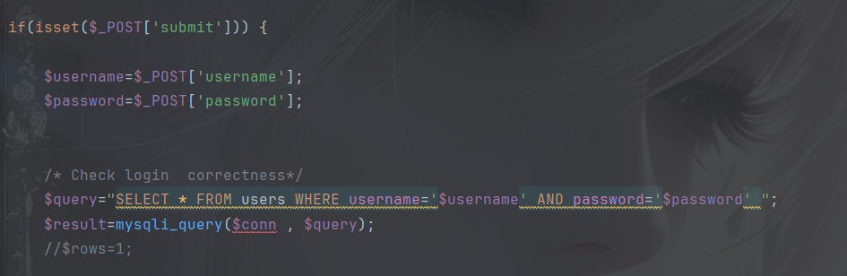
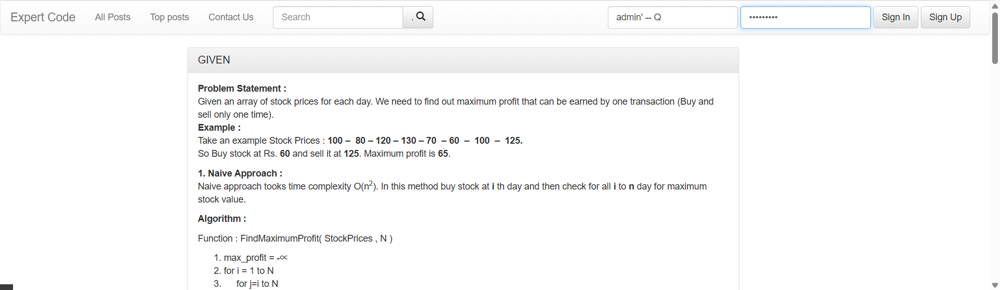
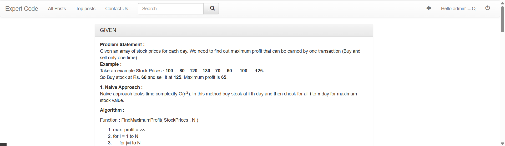
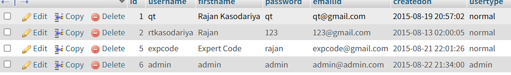

# cve
# Easy Blog Site has sql injection in the login.php file

## supplier

https://code-projects.org/easy-blog-site-in-php-with-source-code

## Vulnerability file

login.php

## describe

This code queries whether the current account exists from the database, and the username and password are not filtered in any way, nor are they normalized through function conversion, resulting in any password being able to log in to the account.

## POC

## Result

登录其他账户
